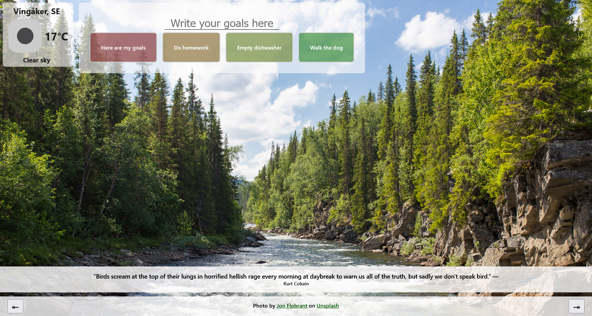

# Inspirational Homepage
This is a project at Codecademy. The goal of the project was to create an inspirational homepage with API calls to fetch weather, quote and images. 

## Screenshot

## Features
### Weather
The app uses your coordinates in order to fetch the local weather at your current location.

### Goals
You can type in your goals for the day. The goals can be marked as done and they can be deleted. The goals get colors in rainbow pattern for a pretty visual effect. Goals marked as done gets greyed out and deleted goals disappers from the screen. 

### Quote
You get a random daily inspirational quote. 

### Image
The homepage fetches a few background-images that you can toogle through. The theme of the images is the swedish forest. 

## Installation and Setup Instructions
1. Installation: `npm install`
2. In the project directory, you can run: `npm start`

Runs the app in the development mode.\
Open [http://localhost:3000](http://localhost:3000) to view it in the browser.
The page will reload if you make edits.